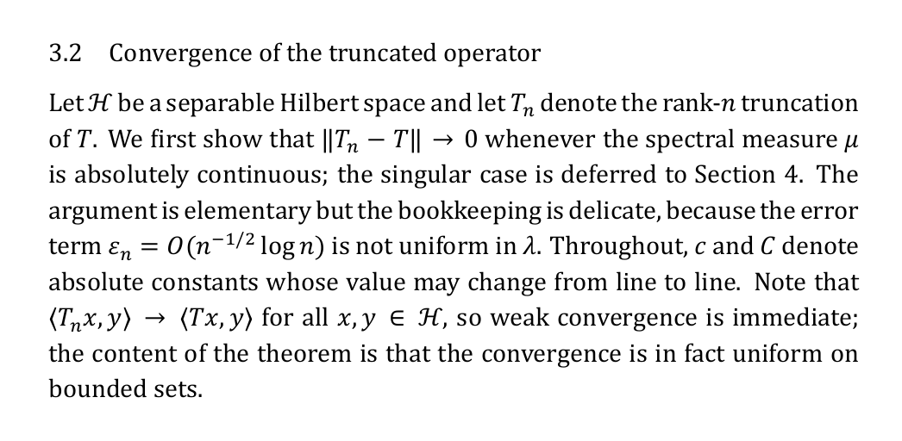

# Fonts

The typefaces chosen by the font bench, packaged with their licences, one image of each in
its intended use, and a LaTeX preamble that sets them all up.

| Purpose | Typeface | Folder | Licence |
|---|---|---|---|
| Papers: body text | Erewhon | `fonts/erewhon` | OFL 1.1 |
| Papers: mathematics | Erewhon Math | `fonts/erewhon-math` | OFL 1.1 |
| Papers, sturdier alternative | XCharter with XCharter Math | `fonts/xcharter`, `fonts/xcharter-math` | Bitstream Charter licence (free); OFL 1.1 |
| Greek in mathematics | Euler Math, Greek letters only | `fonts/euler-math` | OFL 1.1 |
| Slides and screen | Fira Sans with Fira Math | `fonts/fira-sans`, `fonts/fira-math` | OFL 1.1 |
| Code | Fira Code, ligatures on | `fonts/fira-code` | OFL 1.1 |

Two Microsoft faces are part of the recommendation but not of this repository, because they
cannot be redistributed: **Cambria with Cambria Math** as a proprietary alternative for papers
(installed with Windows and Office; embedding in your own PDFs is permitted) and **Segoe UI**
for anything Windows-native.

## The fonts in use

### Papers: Erewhon with Erewhon Math

Erewhon won the final blind round robin of the bench, unbeaten on body text, and none of
the hybrids built on it did better by a visible margin. A sturdy transitional face with small
bracketed serifs, and a maths font of the same design, so text italic and maths italic match.


### Papers, the sturdier alternative: XCharter with XCharter Math

Letter by letter, the picks went to Charter-family shapes above all others: low contrast,
blunt terminals, open apertures, small soft serifs. XCharter is Bitstream Charter extended
for TeX, with a matching maths font. It never beat Erewhon in a paragraph test, so it is the
alternative rather than the default.


### Greek: Euler Math for the Greek letters only

More Greek picks went to Euler than to any other family, and it is upright and calligraphic
by design, so Greek does not read as sloped Latin. The preamble takes only the Greek from it;
everything else stays with the text face's own maths font.


### Slides and screen: Fira Sans with Fira Math

Sans faces lost every prose test, so they stay off papers. For slides and on-screen tables,
Fira Sans has a proper maths companion in the same design, which is rare for a sans.


### Code: Fira Code

Ligatures draw `->`, `<=`, `!=` and `::` as single signs; the zero is slashed.


### Not included: Cambria with Cambria Math

Shown for comparison only. Cambria took a third of the Latin letter picks and its maths font
is complete. Use it from Windows; it is not in this repository.



## Installing

**Windows.** Open a folder under `fonts`, select all the `.otf` or `.ttf` files, right-click,
Install. Do this for each folder you want available to Word, browsers and LuaLaTeX by name.

**TeX Live.** All but Fira Code are on CTAN; installing the packages also gives you the LaTeX
support files:

```bash
tlmgr install erewhon erewhon-math xcharter xcharter-math euler-math fira firamath
```

Fira Code is not on CTAN. Install it from `fonts/fira-code` or point `fontspec` at the file.

## LaTeX

`preamble.tex` holds this. Compile with LuaLaTeX.

```latex
\usepackage{fontspec}
\usepackage{unicode-math}
\setmainfont{Erewhon}
\setsansfont{Fira Sans}[Scale=MatchLowercase]
\setmonofont{Fira Code}[Scale=MatchLowercase, Contextuals=Alternate]
\setmathfont{Erewhon Math}
\setmathfont{Euler Math}[range={\mathup/{greek,Greek}, \mathit/{greek,Greek},
                               \mathbfup/{greek,Greek}, \mathbfit/{greek,Greek}}]
```

For XCharter, replace the two Erewhon lines with `XCharter` and `XCharter Math`. Delete the
Euler line to keep the text face's own Greek.

## Where this came from

A blind tournament of 32 text families and 19 maths families, judged on typeset specimens
(body text, displayed equations, theorem and proof, slide, screen table, character set), then
per-letter pickers over Greek and Latin, run in September 2026. The bench itself is at
<https://github.com/AlexanderBeach/fontbench>. Faces that won the browser-rendered taste round
(EB Garamond, Palatino) lost in typeset paragraphs, where their thin strokes go pale; Computer
Modern and Latin Modern took no letter picks; New Computer Modern rated well when named and
lost every blind pairing to Erewhon.

## Licences

Every font here is free to use, copy and redistribute under the licence in its folder:

- Erewhon and Erewhon Math, XCharter Math, Euler Math, Fira Sans, Fira Math, Fira Code: SIL
  Open Font License 1.1. The fonts may not be sold on their own and the licence must travel
  with them, as it does here.
- XCharter text fonts: the Bitstream Charter free licence, reproduced in
  `fonts/xcharter/README`, which permits use, copying, modification and redistribution with
  the copyright notice and trademark acknowledgement. Bitstream Charter is a registered
  trademark of Bitstream Inc.

The LaTeX support files of the CTAN packages are not included; `tlmgr` provides them.
