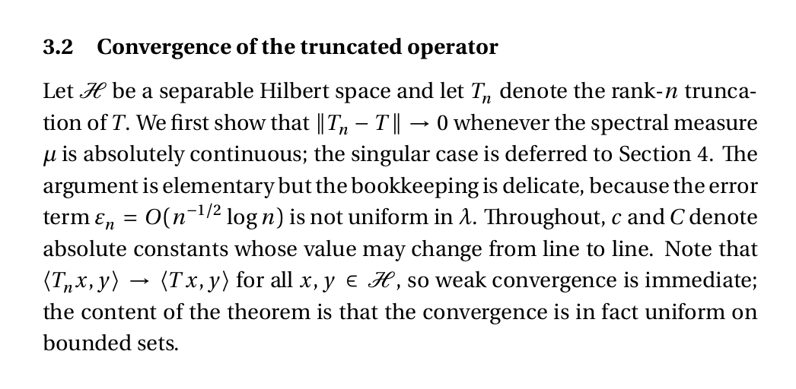
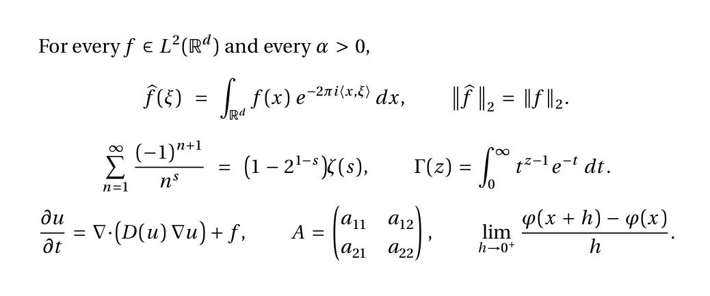
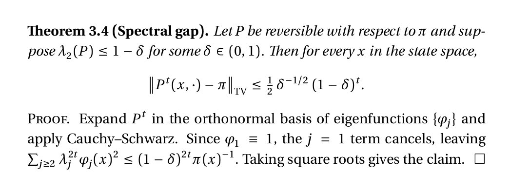
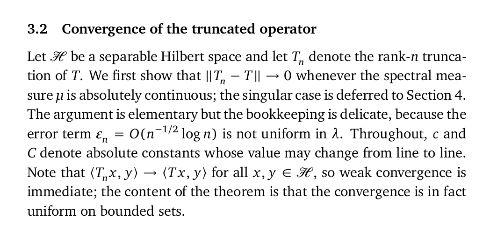
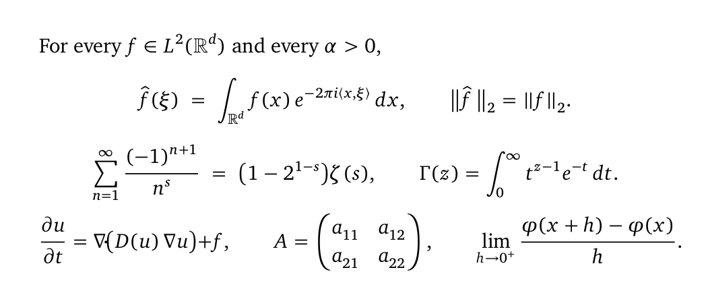
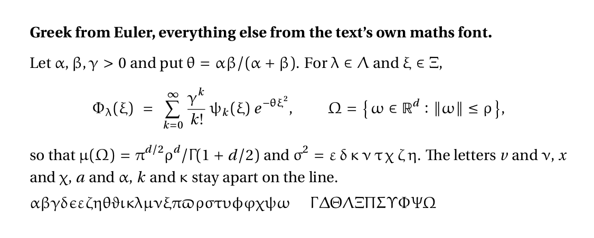
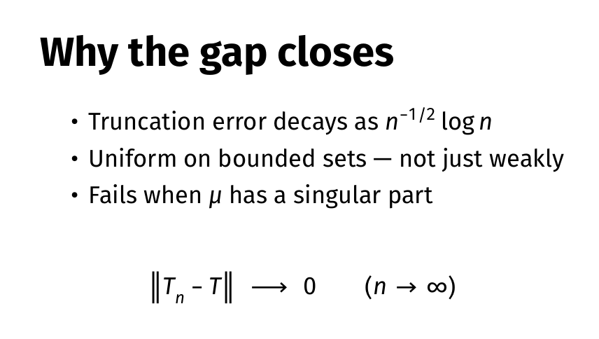
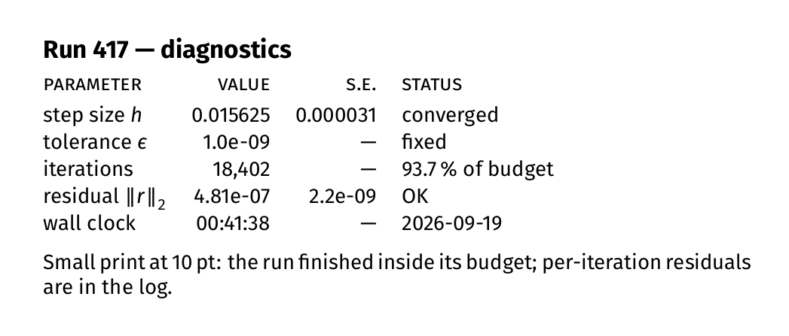
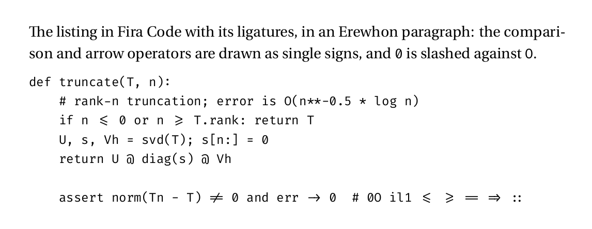

# Fonts

A set of typefaces for papers, slides, screen and code, packaged with their licences, an
image of each in use, and a LaTeX preamble that sets them all up.

| Purpose | Typeface | Folder | Licence |
|---|---|---|---|
| Papers: body text | Erewhon | `fonts/erewhon` | OFL 1.1 |
| Papers: mathematics | Erewhon Math | `fonts/erewhon-math` | OFL 1.1 |
| Papers, sturdier alternative | XCharter with XCharter Math | `fonts/xcharter`, `fonts/xcharter-math` | Bitstream Charter licence (free); OFL 1.1 |
| Greek in mathematics | Euler Math, Greek letters only | `fonts/euler-math` | OFL 1.1 |
| Slides and screen | Fira Sans with Fira Math | `fonts/fira-sans`, `fonts/fira-math` | OFL 1.1 |
| Code | Fira Code, ligatures on | `fonts/fira-code` | OFL 1.1 |

## The fonts in use

### Papers: Erewhon with Erewhon Math

A sturdy transitional serif with small bracketed serifs, derived from Utopia, and a maths
font of the same design, so text italic and maths italic match.







### Papers, the sturdier alternative: XCharter with XCharter Math

Bitstream Charter extended for TeX, with a matching maths font. Low contrast, blunt
terminals, open letterforms and small soft serifs; it holds up well at small sizes and on
screen.





### Greek: Euler Math for the Greek letters only

Euler is upright and calligraphic by design, so Greek letters do not read as sloped Latin
ones. The preamble takes only the Greek from it; everything else stays with the text face's
own maths font.



### Slides and screen: Fira Sans with Fira Math

A humanist sans for slides and on-screen tables, with a proper maths companion in the same
design, which is rare for a sans.





### Code: Fira Code

Fira Mono with programming ligatures: `->`, `<=`, `!=` and `::` are drawn as single signs,
and the zero is slashed.



## Installing

**Windows.** Open a folder under `fonts`, select all the `.otf` or `.ttf` files, right-click,
Install. Do this for each folder you want available to Word, browsers and LuaLaTeX by name.

**TeX Live.** All but Fira Code are on CTAN; installing the packages also gives you the LaTeX
support files:

```bash
tlmgr install erewhon erewhon-math xcharter xcharter-math euler-math fira firamath
```

Fira Code is not on CTAN. Install it from `fonts/fira-code` or point `fontspec` at the file.

## Using them together in LaTeX

The maths fonts do nothing on their own; this is the setup that puts the whole set to work in
one document. It needs LuaLaTeX (or XeLaTeX) and the fonts installed. The images above were
typeset with exactly this.

```latex
\usepackage{fontspec}
\usepackage{unicode-math}
\setmainfont{Erewhon}
\setsansfont{Fira Sans}[Scale=MatchLowercase]
\setmonofont{Fira Code}[Scale=MatchLowercase, Contextuals=Alternate]
\setmathfont{Erewhon Math}
\setmathfont{Euler Math}[range={\mathup/{greek,Greek}, \mathit/{greek,Greek},
                               \mathbfup/{greek,Greek}, \mathbfit/{greek,Greek}}]
```

Line by line:

- `fontspec` lets LaTeX use ordinary OpenType fonts by name; `unicode-math` does the same
  for mathematics, using a font's built-in MATH table instead of the old TeX maths fonts.
- `\setmainfont{Erewhon}` is the text face for body, italic and bold.
- `\setsansfont{Fira Sans}` is used wherever a sans is asked for, such as headings in some
  classes. `Scale=MatchLowercase` sizes it so its lowercase matches Erewhon's, since the two
  faces have different natural sizes at the same point size.
- `\setmonofont{Fira Code}` is the typewriter face for code. `Contextuals=Alternate` switches
  on the ligatures, so `->` and `<=` are drawn as single signs; leave it out for plain
  Fira Code.
- `\setmathfont{Erewhon Math}` sets the maths font: operators, brackets, radicals, italic
  variables, all matched to the text face.
- The last line replaces only the Greek letters with Euler's. `range=` restricts the second
  maths font to the listed characters, and each entry names an alphabet style (upright,
  italic, bold upright, bold italic) followed by the character sets to take from it, here
  lowercase and capital Greek. The plainer `range={greek,Greek}` does not work; the style
  prefix is required.

For XCharter, replace the two Erewhon lines with `XCharter` and `XCharter Math`. Delete the
Euler line to keep the text face's own Greek. For slides in beamer, set Fira Sans as the main
font and Fira Math as the maths font.

## Licences

Every font here is free to use, copy and redistribute under the licence in its folder:

- Erewhon and Erewhon Math, XCharter Math, Euler Math, Fira Sans, Fira Math, Fira Code: SIL
  Open Font License 1.1. The fonts may not be sold on their own and the licence must travel
  with them, as it does here.
- XCharter text fonts: the Bitstream Charter free licence, reproduced in
  `fonts/xcharter/README`, which permits use, copying, modification and redistribution with
  the copyright notice and trademark acknowledgement. Bitstream Charter is a registered
  trademark of Bitstream Inc.

The LaTeX support files of the CTAN packages are not included; `tlmgr` provides them.
